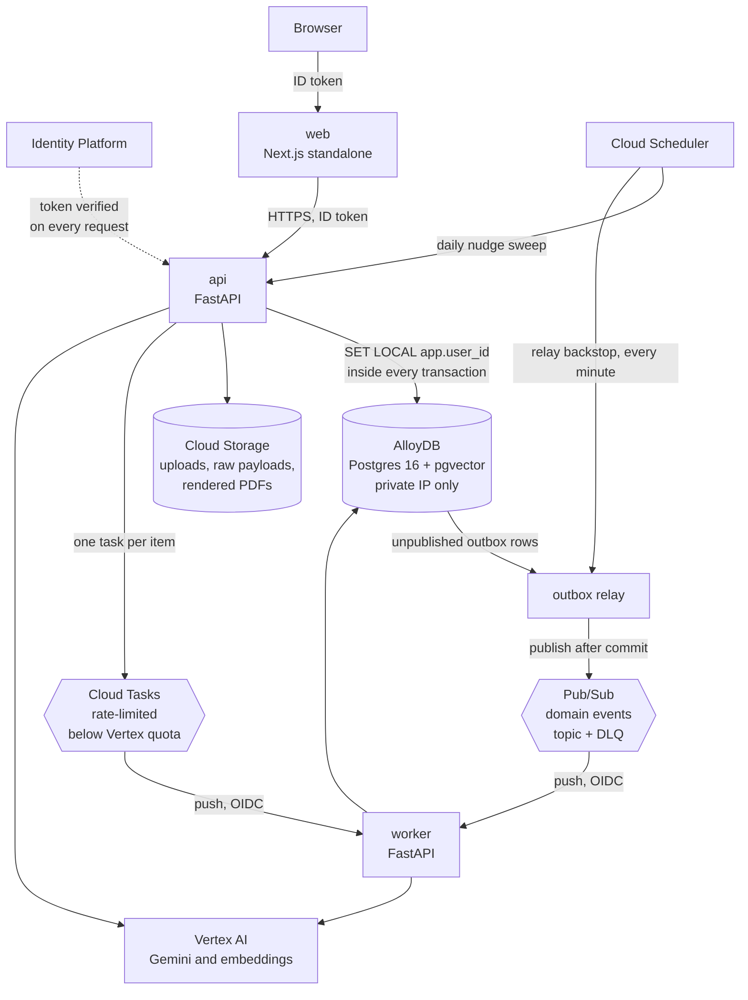
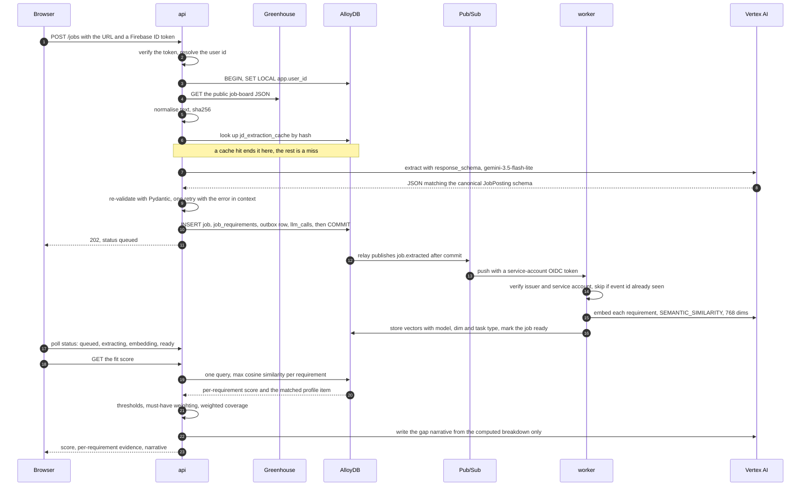

# AI Job Application Tracker

A job search asks for two things that pull against each other. Getting interviews is
partly a volume game, but applicant tracking systems and recruiters screen against a
specific posting, so generic applications underperform. Tailoring properly for every
role takes hours, and across dozens of roles most people quietly stop doing one or the
other. This is the tool I wanted while running that search: paste a posting, get it
broken into requirements, see each requirement matched against something I have
actually done, and generate a tailored resume where every bullet traces back to a line
in my own history. It tracks applications as a state machine, drafts follow-ups when
one stalls, and never sends anything on my behalf.

Built for the AIM Code Kitchen audition on Google Cloud. Deadline 30 September 2026.

---

## Status

Every milestone is built. The product runs end to end on a laptop — sign in, import a
resume, paste a posting, see which requirements and skills you match and which you do
not, generate a tailored resume that cannot cite anything you did not write, track the
application, and draft a follow-up when it stalls — with no Google Cloud credentials
and nothing to pay for.

What is missing is not code. It is a billing account: no Gemini call has ever run, so
every quality number this project exists to produce is still unmeasured. I would rather
this table be accurate than flattering.

| # | Milestone | State |
|---|---|---|
| 0 | Scaffold, tooling, design system, sandbox verification | **Done** |
| 1 | Schema, row-level security with cross-tenant test, Identity Platform auth | **Done**, not deployed |
| 2 | Ingestion: Greenhouse, Lever, pasted text; extraction eval | **Built**. Eval runs; 5 of 15 postings labelled, and Vertex has never answered |
| 3 | Profile import from PDF, deterministic fit score, skills gap | **Built**. Thresholds are defaults, not calibrated |
| 4 | Grounded tailoring, grounding validator, PDF rendering | **Built**. Faithfulness eval needs credentials |
| 5 | Kanban board with stage history | **Done** |
| 6 | Follow-up nudges: sweep, drafts, nothing sent | **Built**. Cloud Scheduler wiring needs a project |
| 7 | Cost instrumentation and `make cost-report` | **Built**. Reports zero, honestly |

Everything below describes the system as designed. Where a section describes something
that does not exist yet, it says so. `docs/SPEC.md` records what each milestone
committed to; `docs/ROADMAP.md` records what I cut and why.

---

## Architecture

Four Cloud Run services, one database, and two queues with different jobs.



A few things in that picture are load-bearing rather than decorative.

A fourth Cloud Run unit is not in the diagram because it is not in the request path:
`migrate` is an Alembic job that runs as `jobtrack_owner` before a deploy shifts
traffic.

**The application connects as a role that owns nothing.** Postgres does not enforce
row-level security against a table's owner unless the table sets `FORCE ROW LEVEL
SECURITY`, and never against a superuser. So `migrate` runs as `jobtrack_owner` and the
services connect as `jobtrack_app`, which holds only DML grants. Every request sets
`SET LOCAL app.user_id` inside its transaction through a SQLAlchemy `begin` event, so
the policy has something to compare against and a forgotten `WHERE user_id = ...`
returns nothing rather than everything. An integration test proves a second user reads
zero rows from every tenant table; that test is a gate, not a nicety.

**Two queues, because they are solving different problems.** Pub/Sub carries domain
events — something happened, whoever cares should react, fan-out is fine. Cloud Tasks
carries per-item LLM work, where the point is a rate limit: `max_dispatches_per_second`
and `max_concurrent_dispatches` sit below the Vertex quota so a user tailoring forty
saved jobs does not spend the whole project's quota in ten seconds. Using Pub/Sub for
both would mean building that throttle myself.

**The outbox exists so a state change and its event cannot disagree.** Writing to the
database and then publishing to Pub/Sub is two operations that can half-fail; the event
gets published and the transaction rolls back, or the transaction commits and the
publish times out. Instead the event is written as a row in the same transaction as the
state change, and a relay publishes committed rows afterwards, with a Cloud Scheduler
backstop every minute for whatever the relay missed. Consumers are idempotent on event
id, because at-least-once delivery means duplicates are normal traffic rather than an
error.

**Contact details never reach Gemini.** Name, email, phone, address and links live in
separate profile fields and are re-attached at render time. This is a redaction
boundary with a test behind it, not a convention someone has to remember.

### One request, end to end

What happens when I paste a Greenhouse URL. This is the designed path; M2 and M3 build
it.



Steps 19 to 21 are the ones worth pausing on. The score comes out of a SQL query and a
threshold, with no model in the path. Step 22 then sends Gemini the computed breakdown
and nothing else, so the narrative cannot introduce a number the computation did not
produce.

---

## Decisions I made

Each of these has an ADR with the context, the alternatives I rejected, and what it
costs me.

**I compute the fit score instead of asking the model for a number.**
([ADR 7](docs/adr/0007-compute-the-fit-score.md)) Asking Gemini to score a resume out
of 100 takes one prompt. It also produces a number that changes between calls, cannot
be calibrated against labelled data, and comes with a justification written after the
fact. Instead: maximum cosine similarity per requirement, thresholds into
covered/partial/missing, must-haves weighted above nice-to-haves. Reproducible and
explainable by construction. The cost is that it is only as good as the embeddings, and
a requirement phrased unlike the user's own words reads as a gap — which is why the
matched evidence is shown next to every judgement.

**The vectors live in AlloyDB, not a vector database.**
([ADR 8](docs/adr/0008-vectors-in-alloydb.md)) Requirements and profile items are
relational rows that need embeddings, not embeddings that happen to have metadata.
Keeping them in `vector(768)` columns makes scoring one query in one transaction under
the same RLS policy as everything else. Vertex AI Vector Search would mean a second
tenant-isolation mechanism, eventual consistency against the operational database, and
a second place resume-derived data lives for `DELETE /me` to find. The price is
AlloyDB's cost floor, which does not scale to zero.

**Three Google Cloud locations, not one.**
([ADR 2](docs/adr/0002-region-and-vertex-endpoints.md)) This one surprised me.
`gemini-3.5-flash` is not served from `us-central1` at all — only `global`, the
`us`/`eu` multi-regions, and a short list that does not include it. `gemini-embedding-001`
is the mirror image: regional only, never `global`. AlloyDB is deployable to neither
`global` nor a multi-region. So a single `REGION` variable has no correct value, and
guessing produces a 404 on the first extraction. `scripts/sandbox_check.sh` probes all
three independently. Routing generation through `global` is also about 10% cheaper per
token than pinning it to a region.

**Flash-Lite for extraction, Flash for generation.**
([ADR 4](docs/adr/0004-model-and-embedding-selection.md)) Extraction is the
high-volume path and the one where the `response_schema` does most of the work.
Generation runs twice per application and is read closely by a human. At list prices
that is 5x the input cost and 3.6x the output cost, worth paying on one and not the
other. Both ids come from the environment, and the extraction eval measures whether
Flash-Lite actually holds up.

**768 dimensions, `SEMANTIC_SIMILARITY`, and the task type is an open question.**
([ADR 4](docs/adr/0004-model-and-embedding-selection.md)) pgvector indexes `vector` up
to 2,000 dimensions, so the model's native 3072 cannot be a plain indexed vector —
`halfvec` reaches 4,000 and is the escape hatch, but 768 costs a quarter of the storage
and builds a far smaller index on a small instance. On the task type: a requirement and
a profile item are the same genre of text, two declarative statements about capability,
which argues for symmetric similarity over the query-to-passage asymmetry of
`RETRIEVAL_*`. That argument is plausible, not proven, so it is configuration and the
M3 calibration eval decides it against hand-labelled pairs. Every vector row stores its
model, dimension and task type, because all three together define the space and a
change to any of them is a re-embed job.

**Deliberate scope cuts, written down rather than discovered later.**
([ADR 5](docs/adr/0005-audition-scope-and-gcloud-deploys.md)) Terraform became
idempotent `gcloud` scripts; Cloud Build became `make check` plus a deploy script that
refuses a dirty tree. Six ingestion adapters became two plus pasted text, because
Greenhouse and Lever share a shape and pasted text covers everything else. What I did
not cut is the eval suite — without measurement, "the score is computed" and "nothing
is fabricated" are marketing.

**The evidence scale is ink density, not traffic lights.**
([ADR 6](docs/adr/0006-design-tokens-in-plain-css.md)) Covered, partial and missing
differ by fill *and* by border style, using one accent at three densities. Red-green
colour vision deficiency affects around 8% of men, and this is the single most repeated
control in the product. It also keeps red meaning what red should mean: a bullet that
failed the grounding validator, not an ordinary gap. Contrast is enforced by a script
that parses the token file and fails the build below WCAG AA, which caught a real
defect the first time it ran.

---

## What is measured

Every number here comes from a command in this repo. These are counts and checks, not
quality measurements — the quality numbers need Vertex AI credentials, and I am not
going to invent them in the meantime.

| Measurement | Value | Command |
|---|---|---|
| Unit tests passing | 296 | `make test` |
| Integration tests passing (real Postgres) | 79 | `make test-integration` |
| Tables, all with a row-level security policy | 12 | `\dp` in psql |
| HTTP endpoints | 25 | `curl localhost:8080/openapi.json` |
| Token contrast pairings at or above WCAG AA | 44 of 44 | `cd apps/web && npm run check:contrast` |
| Python source lines, excluding tests | 10568 | `find packages services evals scripts -name '*.py' -not -path '*/tests/*' \| xargs wc -l` |
| TypeScript and CSS lines, excluding generated types | 3492 | `find apps/web/src -name '*.ts*' -o -name '*.css'` |
| Extraction recall, rule-based baseline | 0.83 | `make eval` |
| Extraction hallucinated-field rate, baseline | 0.00 | `make eval` |
| Model spend to date | $0.00 | `make cost-report` |

**What is not measured, and matters more:** whether the fit score agrees with human
judgement, and whether Gemini's extraction beats the rule-based baseline. Both need
credentials. Both are the first thing I will run when they exist.

The eval suite is the point of this project and it does not exist yet. When it does,
`make eval` writes `evals/reports/latest.md` and a JSON summary, and this section
becomes that table. It will cover:

- **Extraction** — schema-valid rate, per-field accuracy, skill precision/recall/F1,
  hallucinated-field rate (a field filled when the posting does not state it), latency
  p50/p95, and cost per JD, over 15 labelled postings across Greenhouse, Lever and
  pasted text. Model-drafted labels are marked unreviewed and excluded from reported
  metrics until I have reviewed them by hand. Model output is never ground truth.
- **Fit score** — Spearman correlation against my own labels on profile and posting
  pairs, plus the threshold calibration that produced the covered/partial/missing cuts.
- **Tailoring faithfulness** — the share of generated bullets fully supported by the
  profile items they cite, and the agreement between the LLM faithfulness judge and a
  human-labelled subset, because an unvalidated judge is just another model's opinion.

Until those run, I am not claiming the system is accurate. I am claiming it is
reproducible and explainable, which is a property of the design rather than a result.

### List prices

Not measurements — these are published prices I used to make the model choices, from
the [Vertex AI pricing page](https://docs.cloud.google.com/vertex-ai/generative-ai/pricing),
checked 2026-09-11, on the `global` endpoint, in USD per million tokens.

| Model | Input | Output | Cached input |
|---|---|---|---|
| gemini-3.5-flash | 1.50 | 9.00 | 0.15 |
| gemini-3.5-flash-lite | 0.30 | 2.50 | 0.03 |
| Gemini Embedding | 0.15 | no charge | — |

Regional endpoints price the two generative models 10% higher. The pricing page
lists Gemini Embedding on the global endpoint only.

---

## What does not work yet, and what I would change

**No Gemini call has ever run.** This is the one that matters, and everything below is
downstream of it. The Vertex client is written, typed, wired and unexercised, because
the sandbox project has no billing. What runs locally is `HeuristicLlmClient`: a
rule-based extractor and a hashed-lexical embedding space, which exists so the product
works with no credentials and so the eval has a floor to measure against
([ADR 10](docs/adr/0010-llm-boundary-and-offline-operation.md)). It is not a stand-in
for the model, and the interface says which one produced a score.

**So none of the quality numbers exist.** `make eval` reports a recall of 0.83 for the
baseline and `did not run` for Vertex. The fit thresholds are defaults rather than
calibrated against labelled pairs. The grounding validator's rejection rate is
untested against a model that actually rewrites, which is the only interesting version
of that measurement. Five of the fifteen labelled postings exist, and all five are
marked unreviewed because I wrote the labels and the extractor.

**The container images have never been built.** Their inputs are verified — every path
they copy exists and `uv sync --frozen` resolves — and no `docker build` has run, on a
machine with 2.5 GB free. They are the most likely thing here to need a second attempt.

**Nothing is deployed.** `make sandbox-check` is the first thing to run once there is
billing, because if AlloyDB or Vertex is unavailable in the project the plan changes
rather than the schedule slipping.

**Two things I would change with more time.** The lexical arm of the hybrid retrieval
was silently dead for its entire life — `plainto_tsquery` ANDs its terms, so it matched
nothing, and the fused result of one working arm looks exactly like a working fusion. I
found it by reading a page, not from a test. The lesson I would apply is to assert on
each arm's contribution rather than only on the fused output. Second, the heuristic
backend is close to the line ADR 10 draws: it is meant to be a floor, and every
improvement I make to it makes the model's contribution look smaller. It needs to stop
getting better.

**Responsive behaviour is not checked automatically, and it bit me.** A
`repeat(auto-fit, minmax(16rem, 1fr))` grid contributed three 16rem tracks to the
document's intrinsic width, which floored the whole page at 840px and made every phone
scroll sideways. I found it by loading the page in a 360px iframe and comparing
`scrollWidth` against `clientWidth`, and fixed it with `minmax(min(16rem, 100%), 1fr)`
plus `min-width: 0` on the shell grid children. The guard is now CSS discipline rather
than a test, because the test needs a running server and a browser. That is the next
thing I would add to `make check`.

**Editable installs are fragile here for an unusual reason.** This repository sits in
an iCloud-synced `~/Documents`. iCloud sets macOS's `UF_HIDDEN` flag on files, and
CPython 3.11+ deliberately skips any `.pth` file carrying that flag — which silently
disables uv's editable installs, intermittently, whenever sync runs. The symptom is a
`ModuleNotFoundError` that appears and disappears. `PYTHONPATH` is set explicitly in
the Makefile and `pythonpath` in the pytest configuration so imports never depend on
that mechanism; containers install normally and are unaffected. Moving the repository
out of the synced directory would remove the problem entirely.

**What I would change if I were starting again.** I would write
`scripts/sandbox_check.sh` first anyway — it is the one script that can tell me the
plan is wrong before I have built on it — but I would have run `gcloud auth login`
before writing a line of code, so the answer arrived on day zero instead of waiting on
me.

---

## Try it

```bash
make up        # Postgres with pgvector, the Pub/Sub emulator, the auth emulator
make migrate
make dev       # api on 8080, worker on 8081, web on 3000
make demo      # seeds an account with a profile, three postings and two follow-ups
```

Then open `http://127.0.0.1:3000` and sign in as `demo@example.test` / `demo-password`.

No Google Cloud account, no credentials, no billing. `make demo` drives the public API
with a real signed-in token and nothing else, so if it finishes, every endpoint it
touched works for a browser too.

## Running it locally

Local development costs nothing and needs no Google Cloud credentials. Postgres with
pgvector stands in for AlloyDB, and the Pub/Sub and Firebase Auth emulators stand in
for their services. Cloud Tasks has no emulator, so it sits behind a `TaskQueue`
protocol with an in-process implementation rather than a container.

Requires Python 3.12 via [uv](https://docs.astral.sh/uv/), Node 22, and Docker.

```bash
cp .env.example .env        # the local defaults work as-is; the CHANGEME values
                            # are only needed for a cloud deploy
make install                # uv sync --all-packages, npm ci
make up                     # postgres:5433, pub/sub:8085, auth:9099, auth ui:4000
make dev                    # api :8080, worker :8081, web :3000
```

```bash
make check                  # ruff, ruff format, mypy --strict, pytest, then the web checks
make down                   # stop the stack, keep the data
make clean                  # stop the stack, delete the volume
```

Postgres binds 5433 rather than 5432 so the stack coexists with whatever else is
running on the machine. `DB_PORT` moves the bind and the client together.

`make check` is what gates a commit. It runs ruff lint, ruff format check,
`mypy --strict` over all four Python packages, pytest with warnings treated as errors,
then the web app's typecheck, eslint, prettier check, and the contrast check over the
design tokens.

## Deploying

Not yet possible; this is what it will look like. Terraform is deferred
([ADR 5](docs/adr/0005-audition-scope-and-gcloud-deploys.md)), so infrastructure is
created by scripts and deploys run from a laptop.

```bash
export GOOGLE_CLOUD_PROJECT=your-sandbox-project
gcloud auth login && gcloud auth application-default login

./scripts/sandbox_check.sh  # enables nine APIs, then makes one real call against each
```

That script is the gate on everything else. Enabling an API is not the same as being
able to use it — a sandbox can have Vertex AI enabled and still refuse the calls this
depends on, because of org policy, a region restriction, or missing IAM. So each API
gets a real call: `countTokens` against both generative models at `VERTEX_LOCATION`, a
one-token `predict` against the embedding model at `EMBEDDING_REGION`, a cluster list
for AlloyDB, and the Identity Toolkit admin config for Identity Platform. It exits 2
with ranked likely causes if AlloyDB or Vertex AI is unusable, because at that point
nothing else matters.

### Cost

I am not going to put a monthly figure here until I have measured one. What I can say
is where the money goes and what I am doing about it.

The dominant line is AlloyDB, because it is the one component that does not scale to
zero — it bills for provisioned vCPU and memory whether or not anyone is applying for
jobs. Everything else is close to free at demo traffic: Cloud Run runs `min-instances 0`
on every service, Pub/Sub, Cloud Tasks and Cloud Scheduler are effectively free at this
volume, and Cloud Storage holds a few megabytes of PDFs. Gemini usage is a function of
postings processed, at the list prices above.

The controls are the smallest viable AlloyDB shape, `min-instances 0` everywhere, and
stopping the database between working sessions. `make cost-report` (M7) will record
measured cost per JD ingested, per fit score and per tailored resume from the
`llm_calls` table, and that table is what goes here.

## Repo layout

What is in the repository today, and what each directory is for. Several are
skeletons, and I have said which.

```
apps/web            Next.js App Router, design tokens, contrast checker
services/api        Public HTTP API. Routers thin, domain pure, GCP behind interfaces
services/worker     Pub/Sub push and Cloud Tasks handlers
packages/core       Config and logging today. Schemas, db session, RLS helpers,
                    LLM client and the domain layer land in M1 to M4
evals/              Package skeleton. Datasets, runners and reports arrive with M2
scripts/            sandbox_check.sh. deploy.sh arrives with M1, cost report with M7
docker/             Local Postgres init SQL, Firebase Auth emulator image
docs/               BRIEF.md, SPEC.md, ROADMAP.md, adr/
```

`prompts/`, holding versioned prompt files, arrives with M2 when there is a prompt to
version. The web app's TypeScript client is generated from the api's OpenAPI document
once that document has more than a health endpoint in it; the api already sets stable,
readable operation ids for that reason.

Dependencies run one way: `packages/core` imports nothing else in the repo, the
services import `core`, and the web app knows only the OpenAPI document. Ruff bans
relative imports entirely, so every import states which package it crosses into and an
accidental sideways dependency shows up in the diff.

Versions in use: Python 3.12, `google-genai` 2.23.0 with `vertexai=True` (the old
`vertexai.generative_models` module was removed on 2026-06-24), SQLAlchemy 2.0.52
async, `google-cloud-alloydb-connector` 1.14.0 with asyncpg, FastAPI 0.141.1,
Next.js 16.3.4, React 19.2.8, pgvector 0.8.6.

---

## How I built this

<!-- Aditya: this section is yours. -->
